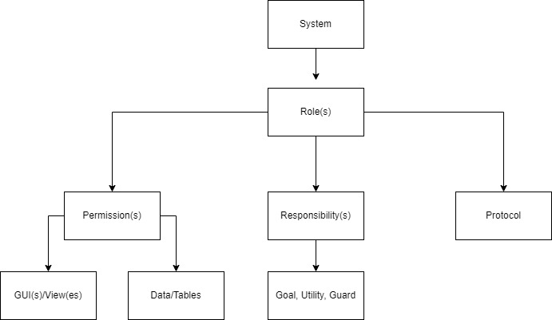

# I.3. System Design Document

#### Table Of Contents :point_down:

[3. System Design Document](#3-system-design-document)
   * [3-1. Goal Hierarchy](#3-1-goal-hierarchy)
   * [3-2. System Architecture](#3-2-system-architecture)
   * [3-3. Roles Identification](#3-3-roles-identification)
   * [3-4. Agents Description](#3-4-agents-description)
   * [3-5. Agents Internal Architecture](#3-5-agents-internal-architecture)
   * [3-6. Technology Overview](#3-6-technology-overview)

## 3. System Design Document

In the **system design document**, we are going to speak about the six pieces of information by following an agent-based development methodology (i.e., GAIA), and create the analysis and design documents specified by the GAIA methodology.This section includes: [Goal Hierarchy](#3-1-goal-hierarchy), [Agent System Architecture](#3-2-system-architecture), [Role Identification](#3-3-roles-identification), [Agent Description](#3-4-agents-description),  [Agent Internal Architecture](#3-5-agents-internal-architecture), and finally [Technology Overview](#3-6-technology-overview).

### 3-1. Goal Hierarchy

Using GAIA, we think of each agent as having the resources of a computational
process. It is presumable that the objective is to create a system that maximizes a particular global quality metric. From the perspective of the system's constituent parts, nevertheless, this structure might not be ideal.

The GAIA approach encourages developers to see creating software systems as an organizational design process with software agents serving as its building blocks. Therefore, in our analysis phase, first we focus on identifying roles and their properties as shown in the following figure.

 Role detection process

### 3-2. System Architecture

### 3-3. Roles Identification

### 3-4. Agents Description

### 3-5. Agents Internal Architecture

### 3-6. Technology Overview