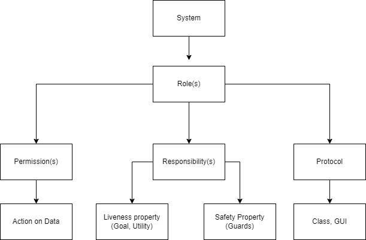

# I.3. System Design Document

#### Table Of Contents :point_down:

[3. System Design Document](#3-system-design-document)
   * [3-1. Goal Hierarchy](#3-1-goal-hierarchy)
   * [3-2. System Architecture](#3-2-system-architecture)
   * [3-3. Roles Identification](#3-3-roles-identification)
   * [3-4. Agents Description](#3-4-agents-description)
   * [3-5. Agents Internal Architecture](#3-5-agents-internal-architecture)
   * [3-6. Technology Overview](#3-6-technology-overview)

## 3. System Design Document

In the **system design document**, we are going to speak about the six pieces of information by following an agent-based development methodology (i.e., GAIA), and create the analysis and design documents specified by the GAIA methodology.This section includes: [Goal Hierarchy](#3-1-goal-hierarchy), [Agent System Architecture](#3-2-system-architecture), [Role Identification](#3-3-roles-identification), [Agent Description](#3-4-agents-description),  [Agent Internal Architecture](#3-5-agents-internal-architecture), and finally [Technology Overview](#3-6-technology-overview).

### 3-1. Goal Hierarchy

Using GAIA, we think of each agent as having the resources of a computational
process. It is presumable that the objective is to create a system that maximizes a particular global quality metric. From the perspective of the system's constituent parts, nevertheless, this structure might not be ideal.

The GAIA approach encourages developers to see creating software systems as an organizational design process with software agents serving as its building blocks. Therefore, in our analysis phase, we planned to extract 5 models from the requirements.

 Goal Hierarchy

### 3-2. System Architecture

### 3-3. Roles Identification

One of the main steps in GAIA methodology is to identifying roles based on the following chart. 

 Role detection process

Therefore, here is a table that demonstrates the detected roles. 

| :point_right: |Role|By means of?|What?|What?|How?|
|-|-|-|-|-|-|
|Row#|Role Name|Permissions|Liveness Property|Safety Property|Protocols|
|1|Sign Up|Read and Write users data|Handles the process of sign up for Providers and Clients|Checks validity of user data.|Registration|
|2|Sign In|Read users data, Authenticate user, Create Session|Handles the process of authentication. If user exists then creates a session. Also, create guest session for Guests.|Checks for active users, and apply SQL injection guards|Authenticator|
|3|Search Engine|Read providers data|Apply a query on Keywords column of providers table|Deliver a list of providers based on the data that user allowed to access.|SearchEngine|
|4|Bid Handler|Read and write on bids data|Handles the process of creating, accepting, or rejecting a bid|Checks if Clients have any waiting bid or not. Only one bid per Provider is allowed. |Bid|
|5|Contract Creation|Read and Write contracts data|Handles the process of creating contracts and sends the contract to both sides after Provider accepts the bid.|Checks if there is no contracts waiting for acceptance for these 2 parties. |CreateContract|
|6|Project Creation|Read and Write projects data, Read contracts data|Handles the process of creating the project based on the Client request after accepting contracts by both side.|Checks both Provider and Client have been accepted the contract and there is no project in database. |CreateProject|
|7|Payment Handler|Reads and write payment data|Handles the process of Payments|Checks if payments has not yet been done, Checks if payment is equal to what we have in Contract.|TransferMoney|
|8|Project Tracker|Reads and write projects progress data|Handles the process of tracking project progress, deadline and estimations|Checks if project is still active.|TrackProject|
|9|Project Change Handler|Read and write projects data|Handles the process of changing a project, upon the Client request. Delivers the changed requirement/contract to Provider.|Checks if there is no change request in database. |ChangeProject|
|10|Message Handler|Read and write messages data|Handles the process of sending messages between Provider and Client in a specific chatroom|Checks if user belongs to a chatroom|Message|
|11|Feedback Handler|Read and write feedback data|Handles the comments and ratings of projects|Checks if user has worked with feedback receiver via a contract in the past. Checks if user has not yet deliver a feedback related to an experience.|Feedback|

### 3-4. Agents Description

### 3-5. Agents Internal Architecture

### 3-6. Technology Overview