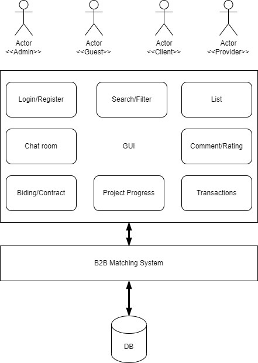

# I.2. System Specifications

#### Table Of Contents :point_down:

[2. System Specifications](#2-system-specifications)
   - [2-1. Business Case](#2-1-business-case)
   - [2-2. System Description](#2-2-system-description)
   - [2-3. Assumption](#2-3-assumption)
   - [2-4. Requirements](#2-4-requirements)
   - [2-5. Wish List (Not implemented)](#2-5-wish-list-not-implemented)

## 2. System Specifications

In the **system specifications document**, we are going to speak about the five pieces of information. First we discuss the reasons why such a system is in demand from a business perspective in the [Business Case](#2-1-business-case) section. Then, in the [System Description](#2-2-system-description) section, we describe the main features of the application. Later, in the [Assumption](#2-3-assumption) section, we discuss the pre-existing conditions that we assumed are there in place before starting the development. In the fourth part, actually [Requirements](#2-4-requirements) we reflect the whole requirements that we have received from the customer. Finally, in the [Wish List](#2-5-wish-list-not-implemented) section, we determine which part of requirements are going to be planned for the future revisions and are not going to be delivered in our implementation. 

### 2-1. Business Case

Due to the widespread use of the internet and smartphones, new applications are constantly emerging that are changing how we approach problems on a daily basis. The demand for new apps is increasing steadily all around the world, yet there aren't even that many IT companies in different regions. As a result, some technologies are required to link clients to suppliers around the globe. Our **B2B Research Matchmaking** serves as a link between customers and suppliers.

**Providers** can reveal their abilities by providing their resume and some topics that they are interested in and have enough power for implementing projects in that area. 

In the other side our **Clients** can search in our database, review the resume of different providers, select them, and bid a price for a specific project. 

If any deal happen during this process, then the selected **Provider** can enjoy *70%* of the deal, the **Client** can have a nice functional application on time, and **the System** can continue its operation using the rest of the *30%* of the deal.  

### 2-2. System Description

**The System** contains four agents. First, **the Host** or as it has been called in the requirements **the System**. This agent is responsible to *store* <ins>data</ins>, *moderate* <ins>messages</ins> and *connect* the other agents. Then **Providers**, which *provide* services by *introducing* themselves via <ins>yellow pages</ins>. In contrast, we have **Clients** which *search* and *consume* services. Finally, we have **Guests** that are a limited version of **Clients** which are more for *discovering* and *evaluating* the main functionality and examining the quality of data in our <ins>database</ins>. If a **Guest** find the information and services interesting, they *can register* and *become* a **Client**. Being a **Client** means they can start *biding* **Providers**.

As mentioned before, **the System** *charges* providers with *30%* <ins>commission</ins>. Therefore, besides of <ins>registration</ins> and <ins>searching</ins> modules, there must be an <ins>accounting</ins> module which *keeps track of* <ins>financial transactions</ins>.

All actors, can access to their <ins>dashboard</ins> via a <ins>login</ins> mechanism which is not delivered in the first phase. In fact, we mock the <ins>login</ins> by simulating the <ins>sign in</ins> mechanism.

Last but not least, we are not going to deliver the <ins>chat</ins>, <ins>commenting</ins> and <ins>rating</ins> features. We will discuss them in our design phase, however, in the implementation phase we exclude them for the first phase.   

 System High-Level Design

### 2-3. Assumption

In this section, we discuss the pre-existing conditions that we assumed are there in place before starting the development and we build our design by assuming them.

1. In our GUI, we won't provide any <ins>login mechanism</ins> for our actors. We would have a database which keeps records of our **Providers** and **Clients**. When already registered users want to login, they can just select their name from a list and press on the <ins>login</ins> key and then sign in. We assumed they don't abuse this situation and each use only login to his or her account.  
2. For persisting the data, we will use one of the embedded databases in Java. A few of the dominant providers are available for choosing (i.e., [H2](http://www.h2database.com/html/main.html), [HyperSQL](http://hsqldb.org/), [Apache Derby](http://db.apache.org/derby/), [Berkley DB](https://www.oracle.com/database/technologies/related/berkeleydb.html), [Java DB](https://www.oracle.com/technetwork/java/javadb/overview/index.html), [ObjectDB](http://www.objectdb.com/), and so forth. However, in this stage we don't know which database will be selected. We will select one due to the performance, price, and the license. 
3. We have a specific policy and guideline for using any OSS component during our implementation. If we need to leverage any OSS component, we must make sure that we fulfill these steps:
   1. First of all we only accept libraries and components that have MIT license.
   2. If any OSS component does not have MIT license we must not use them. 
   3. We must provide an static copy of the jar file in a separate folder in the lib directory. For example, for using a jar file as `xyz.jar`, we must make a sub folder `xyz` inside the `\lib` directory and put the jar file in it.  
   4. We must provide the license file beside of the jar file. 
   5. We must avoid copy/paste any snippet of code from any website or mailing list, specially [Stackoverflow.com](https://stackoverflow.com/).

### 2-4. Requirements

In this section, you can find the requirements. Each actor (i.e. agent) has been coded by **bold** style. Each action/verb has been declared by *italic* style. Finally, each attribute has been identified by <ins>underline</ins> style.

1. Ability to *sign up* as **Provider** and **Client**.
2. Ability to be a **Guest** and *visit* the app.
3. For **Providers**: ability to *submit* <ins>name</ins>, <ins>website</ins>, <ins>logo</ins>, <ins>resume</ins>, <ins>special keywords</ins>, <ins>hourly compensation</ins>.
4. **Providers** *can get* a <ins>verified icon</ins> if they *send* their <ins>proof of business</ins> to **the System**.  **The System** should *make sure* that every piece of information *is correct* and then *accept* the request.
5. For **Guests**: ability to *search* <ins>keywords</ins> and *get* a <ins>list of available Providers</ins>.
6. A <ins>contract</ins> should be *sent* to a **Provider** the moment they *sign up*. 
7. **Provider** should be able to *accept* or *reject* the <ins>contract</ins>.
8. Upon <ins>rejection</ins>, the **Provider** will be automatically *converted* to a **Client**, *losing* their <ins>resume</ins>, <ins>website</ins>, <ins>special keywords</ins> and <ins>hourly compensation information</ins>.
9.  When a **Guest** *visits* the **App**, they can only *see* the <ins>name</ins>, <ins>website</ins>, <ins>logo</ins>, <ins>resume</ins>, and <ins>special keywords</ins> of **Providers**. They *cannot see* their <ins>hourly compensation</ins>. Also, they *cannot place* a <ins>bid</ins> for the **Provider**.
10. Signed-up Agents (**Providers** and **Clients**) *can see* <ins>every piece of information</ins> available on **the system**.
11. **Providers** *can choose* between <ins>Basic</ins> and <ins>Premium plans</ins>.  <ins>Premium subscribers</ins> will *appear* first on <ins>the search list</ins>, regardless of their <ins>approval ratings</ins> or <ins>hourly compensation</ins>.
12. The <ins>sorting algorithm</ins> always *puts* <ins>Premium</ins> **Providers** on top, then <ins>verified</ins> **Providers**, and then the rest. Between each group, **Providers** should be *sorted* based on their <ins>approval ratings</ins> by default (can be changed).
13. A **Client** is able to *change* the sorting of <ins>results</ins> upon searching a <ins>keyword</ins> (e.g. **Clients’** <ins>approvals</ins>, <ins>number of projects done</ins>, the <ins>amount of hourly compensation</ins>).
14. A **Client** *can request* a **Provider** and *place* a <ins>bid</ins>. The <ins>bid</ins> *can be a different* <ins>value</ins> than <ins>the hourly compensation</ins> of the **Provider**.
15. **Provider** *can accept* or *reject* a <ins>bid</ins>.
16. A *rejection* from the **Provider** will be directly *sent* to the **Client**.
17. *Accepting* a <ins>request</ins> from the **Provider** will go through **the System** first, and not directly to the **Client**.
18. **The System**, upon *receiving* an <ins>accept confirmation</ins>, will *pull up* a <ins>contract</ins> and *send* it to both **Provider** and **Client**.
19. **Provider** and **Client** *can accept* or *reject* the <ins>contract</ins>.
20. Any *money transfer* will be *handled* by **the System**.   **The System** will *receive* 30% of any <ins>transaction</ins>. This <ins>info</ins> should *be* in the <ins>contract</ins>.
21. Ability to *watch* the <ins>progress</ins> of the project for the both sides (**Provider** and **Client**).
22. The <ins>tracking page</ins> will *show* the <ins>tentative deadline</ins>, <ins>progress so far</ins>, and <ins>estimated time of completion</ins> based on the current pace.
23. A <ins>chat room page</ins> will *be created* for **Client** and **Provider** once a project *gets accepted*.
24. Any <ins>change request</ins> from the **Client** must first *get accepted* by the **Provider** after a project <ins>begins</ins>. <ins>Deadlines</ins> could *change* based on **Provider’s** request
25. When a project *is done*, the **Client** *can leave* a <ins>comment</ins> and <ins>rating</ins> for the **Provider**,
26. A **Provider** *can also leave* a <ins>comment</ins> and <ins>rating</ins> for the **Client**. **Provider**s *can see* the <ins>past ratings</ins> of a **Client** when there is a <ins>new bid</ins>.
27. The app **must** have a <ins>GUI<ins>.

### 2-5. Wish List (Not implemented)
It seems we can implement all requirements, except the number 21 till 26. Basically, it means we assume all parties are satisfied from each other and there is no need for monitoring or rating. Therefore, we hope to be able to implement items 1 to 20 and also number 27 that requests a mandatory GUI. And we put items 21 to 26 in our wish list. 
