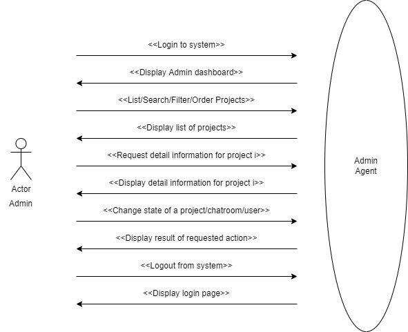
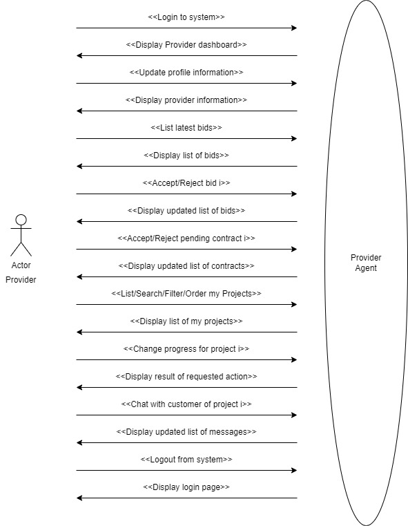
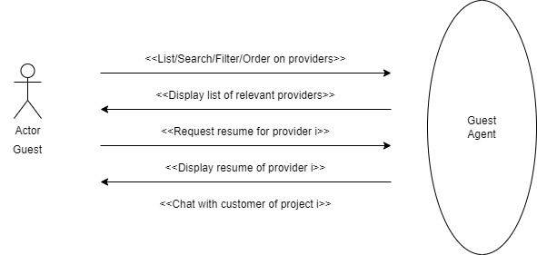
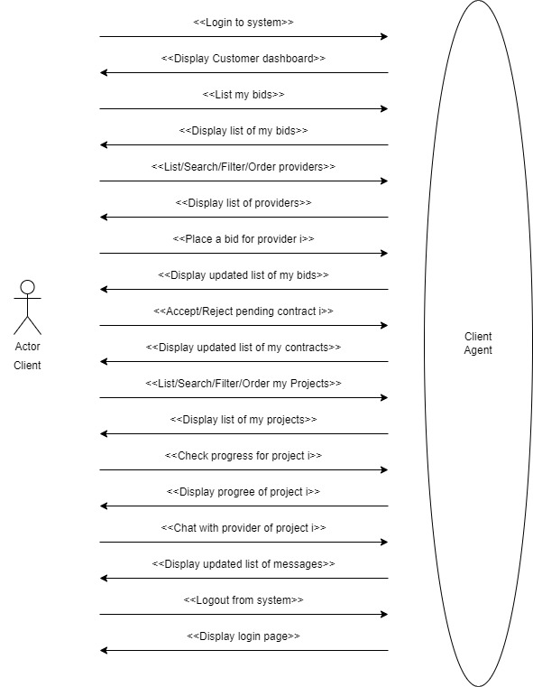
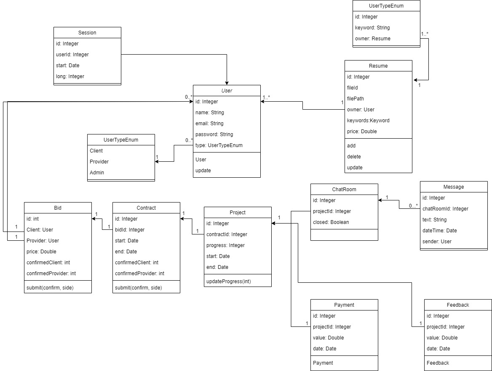

# Detailed Design Document

## Actors

Our B2B Matchmaking System contains four main actors which are listed below:
1. Admin
2. Provider
3. Guest
4. Client

## 4-1. Use cases

In the following you can find the role of each actor in more detail and the related use case diagram. Please note that message sequences also has been shown in the use case diagrams. 

### 1. Admin

The admin agent enables superusers to moderate and manage the system with unlimited access. A simple example is suspending a user or deactivating the system for a few hours to apply some updates. Also, we assume that the duty of the accountant user is done by the admin user. Performing a project can charge a provider's bank account by the admin. 

 Figure 4.1: Admin use case diagram

### 2. Provider

The provider agent provides services associated with registering providers in the system. Providers can submit some keywords and upload a resume file related to the services they can offer to consumers. The provider will receive bids for their services from a number of customers. The provider can either accept or reject the bid request here. In addition, providers can chat with customers and keep them up to date on project progress.

 Figure 4.2: Provider use case diagram

### 3. Guest
Guest users can only search for providers based on keywords. Therefore, the guest agent provides limited functionalities. For instance, searching the database of providers and gaining access to limited information about them, such as keywords, resumes, and compensation. Guests cannot place a bid or access the contact information of providers. 

 Figure 4.3: Guest use case diagram

### 4. Client
A customer/client can search the providers database and then place a bid on a provider. A contract must be signed by both parties after the bid has been accepted by the provider. Customers can check the progress of their projects and chat with related providers. The client service agent must provide services to fulfill customers' needs.

 Figure 4.4: Client use case diagram

## 4-2. Class Diagram

Here is a figure which illustrates the relationship between our classes. 

 Figure 4.5: Class diagram

