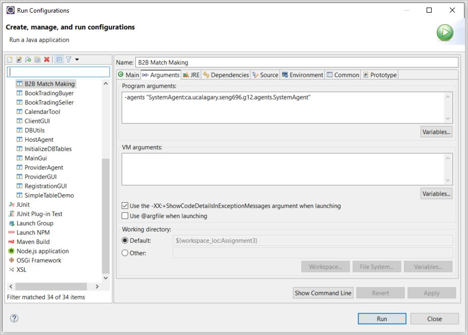

# SENG696-F2022-G12
This is the implemented JADE project related to **group #12** for doing the assignments of SENG696 in Fall 2022.

| Group \#:       |                    12                |
|-----------------|--------------------------------------|
| Student Names:  |  1. Askari, Majid                    |
|                 |  2. Ghorbanian, Mahta                |
|                 |  3. Jaberzadeh Ansari, Mahdi         |
|                 |  4. Mirshafiee Khoozani, Mitra Sadat |

## How to run it:
For running the project chase the following steps:
1. First open the `Assignment3` folder as a Java project in Eclipse.
2. Check the run configuration to have the following settings:
   1. It must have the `jade.Boot` as the `Main class`:
      
   2. The option `Include system libraries when searching for a main class` must be checked. 

3. Pass the following run time arguments in the second tab:
   
   ```
   -agents "SystemAgent:ca.ucalagary.seng696.g12.agents.SystemAgent"
   ```
   

4. Finally by running the application you must be able to watch this output:

   
